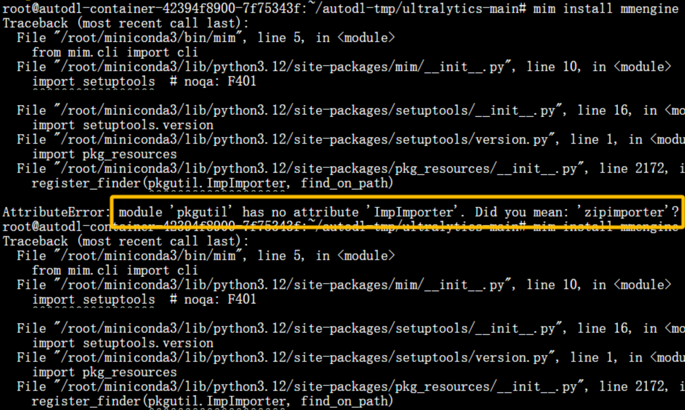

在使用 openmin 安装 mmcv 与 mmengine 时遇到了报错 module 'pkgutil' has no attribute 'ImpImporter'. Did you mean: 'zipimporter'?。



```
python -m ensurepip --upgrade
```

运行后仍然无法解决。

后发现，一共需要运行两条命令更新两个组件，更新完之后问题完美解决。命令如下。

```
python -m ensurepip --upgrade
python -m pip install --upgrade setuptools
```

注：出现这个报错后直接依次运行这两行代码然后再次运行刚才报错的命令，运行完这两行代码之后不要重装刚才报错的库，不然还会报错。