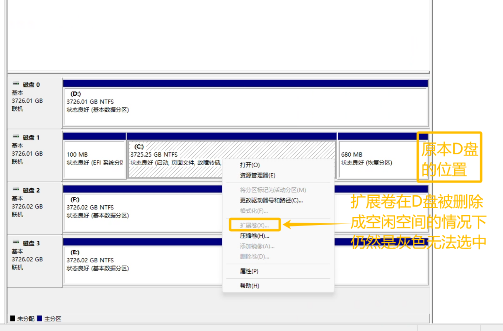
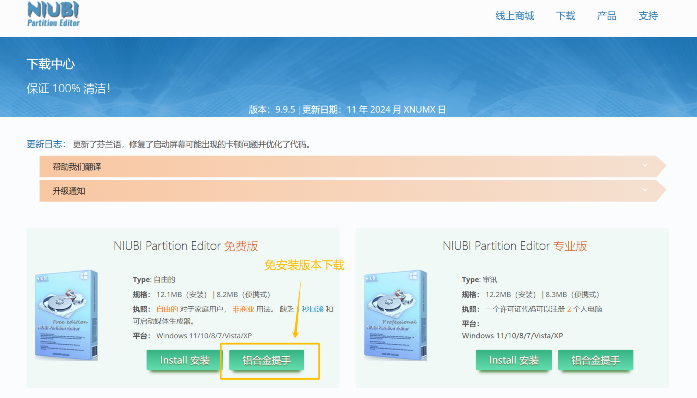
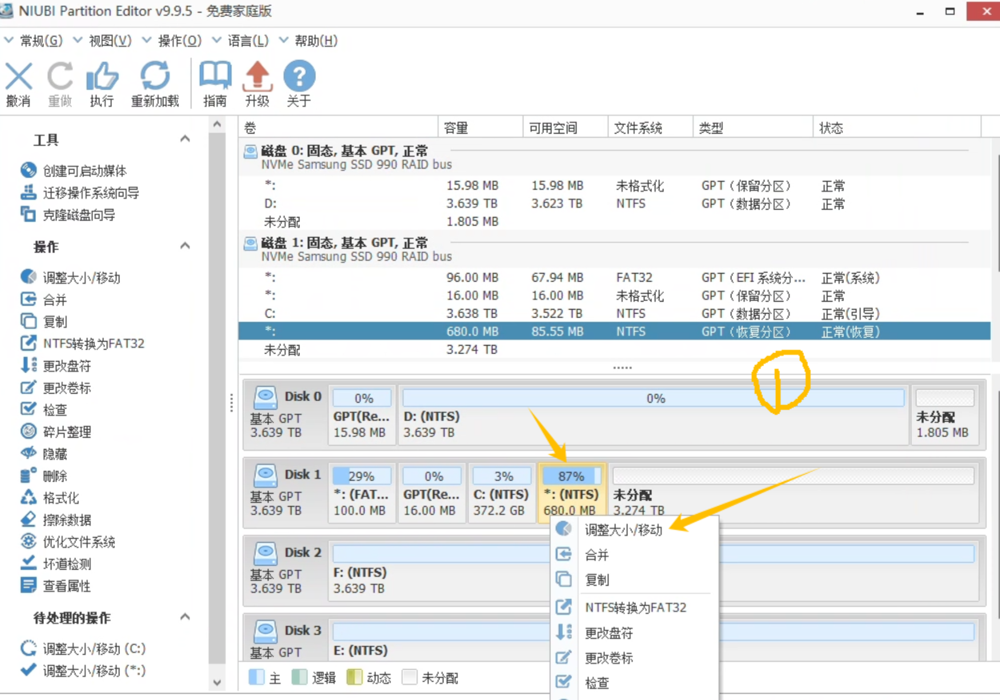
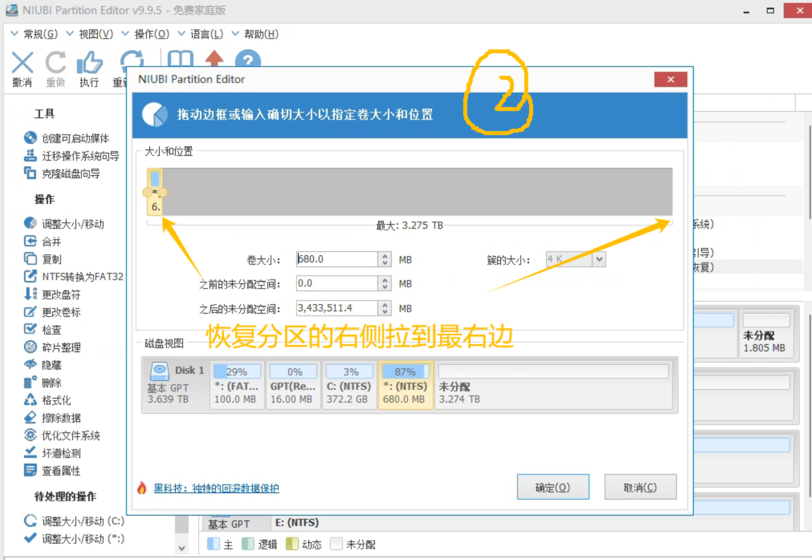
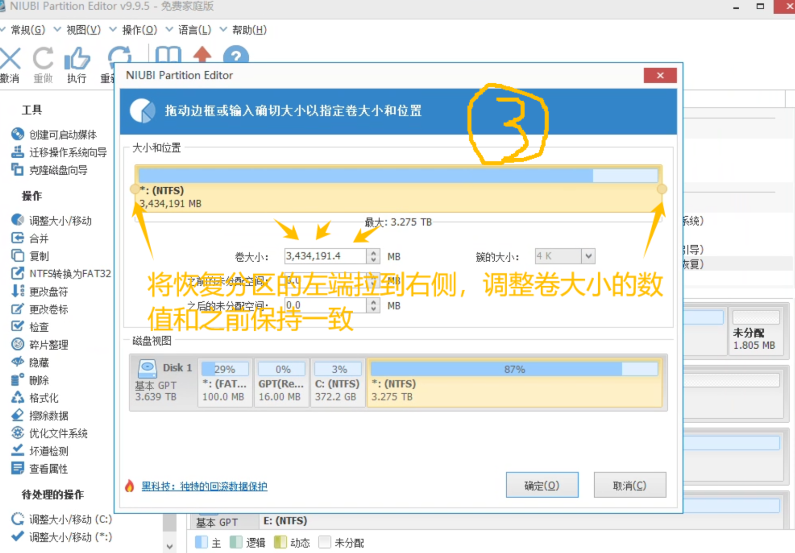
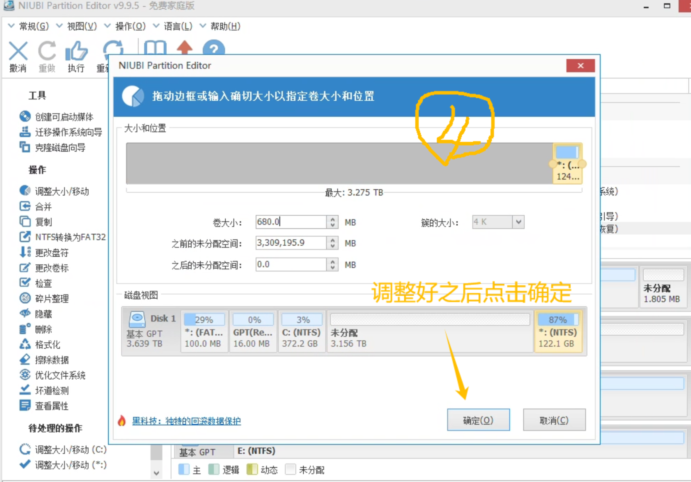
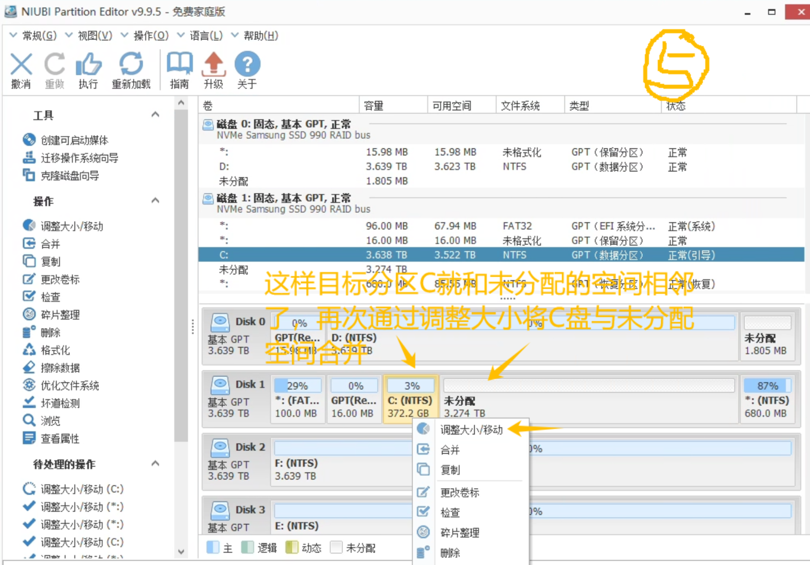
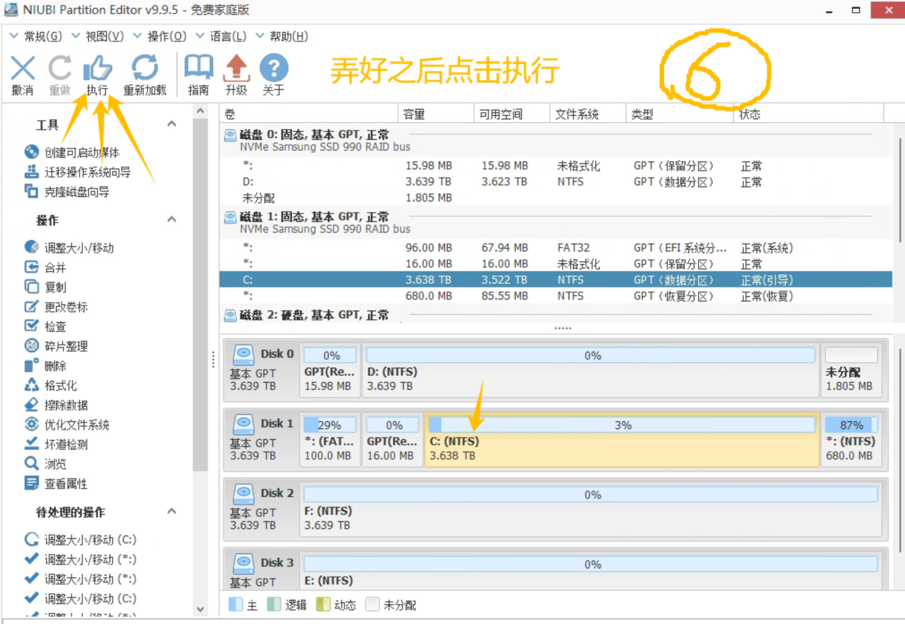

学院新采购了服务站来部署本地大语言模型，一看配置，是至强4216 x 2的处理器、4090的显卡、64GB的内存，美滋滋。

结果看到硬盘，4 x 4T的硬盘就给C盘分了不到400G。。。

这么小的C盘用到后面肯定是爆满跑不动了，第一件事就是准备把一整个硬盘的空间都分给C盘，这样后面就算有小白接手这台服务站，也不至于随便搞搞就把系统盘搞爆满了。

直接打开计算机磁盘管理把与C盘在同一块磁盘上的D盘删除卷，把空间空出来。结果再选回C盘想要扩展卷的时候，发现C盘的扩展卷是灰色的，怎么都点不了。

网上搜了一大圈，说是不相邻的空间无法用磁盘管理合并到一个盘符中，回来一看，果然，C盘和原本D盘的中间夹了一个680MB的恢复分区，直接无语。。。

发现这个问题后尝试了DiskGenius和傲梅分区助手，发现这俩工具虽然可以选择将C盘和这个不相邻的空闲空间合并，但是由于C盘是系统分区，需要重启进入PE才能操作，系统中操作不了。

于是按照软件提示重启、进入PE，然后就傻眼了。。。

不知道是不是因为硬盘组了RAID的原因，四个硬盘在这俩工具的PE里只能读到两个，C盘所在的硬盘直接读不到。。。

找了个U盘部署上微PE，想进入自己的PE试试，结果开机进入BOOT菜单，尝试了几次都读不到U盘启动选项，再次无语。。。

集齐这么多条件达到这样困境的人可能确实比较少，网上检索了好久也没找到同样情况下的完美解决办法。

这么贵还不是自己的主机实在是不敢随便乱搞，最后终于被我找到了一个可以完美解决这个问题的工具，听名字就知道牛逼，[NIUBI Partition Editor](https://www.hdd-tool.com/zh-CN/download.html)，官方提供免费使用的绿色免安装版本，良心啊！！！

这个工具可以在调整分区大小的同时移动分区所在磁盘中的位置，只要先在工具中选中夹在中间当电灯泡的恢复分区，将其移动到最边上，就可以让目标磁盘分区和空间空间相邻合并了！！

短短几步完美解决！！！！！！！