### 1.安装大语言模型部署运行工具Ollama

访问Ollama官网「[https://ollama.com/](https://ollama.com/)」点击屏幕中心的「Download」按钮，进入下载界面。

 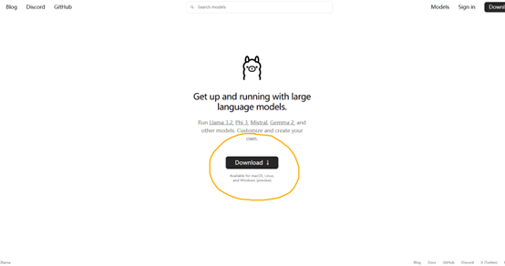

在下载界面中，选择对应操作系统的安装方式。以Windows为例，我们点击「Download for Windows (preview)」按钮下载Windows安装包。

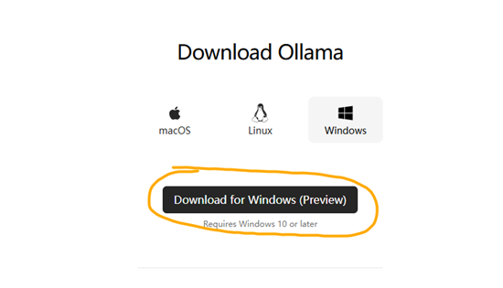

由于Ollma的服务器在国外，这一步可能会比较慢。经过耐心的等待，我们可以得到大小约为663MB的「OllamaSetup.exe」文件。

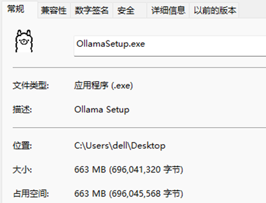

双击「OllamaSetup.exe」文件运行，并单击「Install」开始安装。

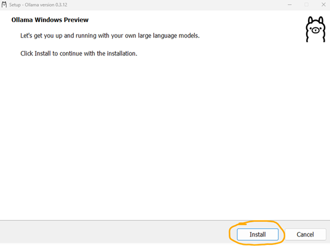

安装完成后，Ollma会自动运行在系统后台中。我们在任务栏中找到Ollama图标，鼠标右击选择「Quit Ollama」按钮将其退出，进行下一步的配置。

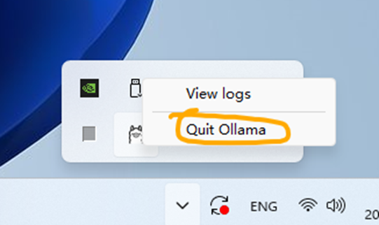

### 2.配置Ollama on Windows

Ollama默认将随Windows启动而自动启动，可以在文件资源管理器的地址栏中输入「%APPDATA%\Microsoft\Windows\Start Menu\Programs\Startup」并按下回车进入启动运行路径。在该路径中删除其中的「Ollama.lnk」快捷方式文件，即可阻止Ollama随系统启动而自动启动。也可复制该快捷方式文件至其他位置，方便在需要时快速运行Ollama。

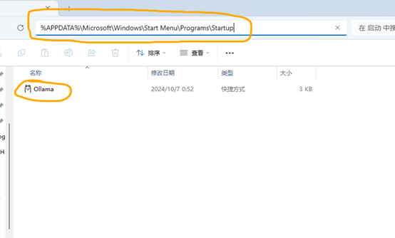

Ollama 的默认模型存储路径为「C:\Users\%username%\.ollama\models」,为了防止模型文件大量占用系统盘空间，我们可以通过修改环境变量的方式修改Ollama的模型存储路径。

按下「Windows + R」快捷键打开「运行」对话框，输入「C:\Windows\system32\rundll32.exe sysdm.cpl, EditEnvironmentVariables」命令后按下「Ctrl + Shift + Enter」快捷键以管理员权限打开「环境变量」窗口。

在「环境变量」窗口中选择「新建」一个「用户变量」，变量名设置为「OLLAMA_MODELS」，变量值则为我们想要存储Ollama的模型的路径，这里以「D:\Ollama\Models」路径为例。输入好后，依次单击两个「确定」按钮逐级保存并关闭窗口。

Ollama API 的默认侦听端口为「11434」，并且只监听来自「127.0.0.1」或「localhost」的请求。如果有其他的访问需求，则需要开放跨域限制，可以使用相同的方式添加一个名为「OLLAMA_HOST」的用户变量，并将变量值设置为「0.0.0.0:」+「需要修改的端口」，我们以「0.0.0.0:11435」为例。

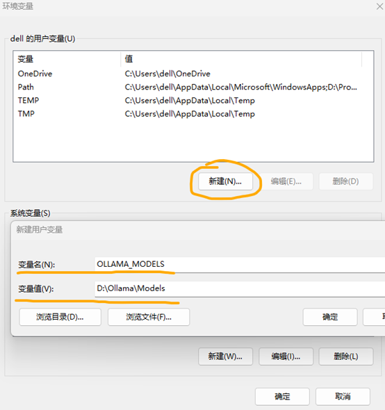

设置好的用户变量如下。

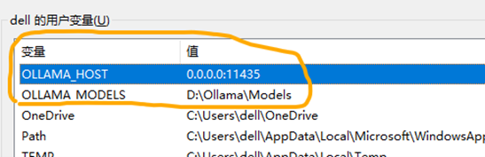

全部设置好后，我们按下「Windows + R」快捷键打开「运行」对话框，输入「cmd」命令后按下「确定」按钮打开「命令提示符」窗口。在「命令提示符」窗口中分别输入「echo %OLLAMA_MODELS%」、「echo %OLLAMA_HOST%」检查新配制的环境变量是否生效。

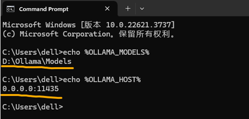

检查无误后，通过前面保存的快捷方式重新运行Ollama。打开浏览器访问「http://127.0.0.1:11435/」看到「Ollama is running」则说明Ollama配置成功。

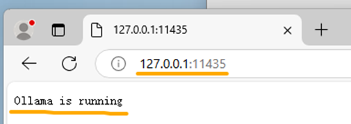

### 3.通过Ollama获取并运行大语言模型

访问Ollama的官方模型库「https://ollama.com/library」选择一个合适自己需求的模型以及合适的模型大小，保存其对应的运行指令。

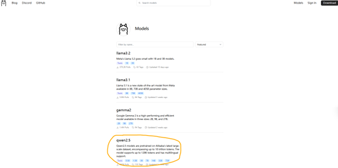

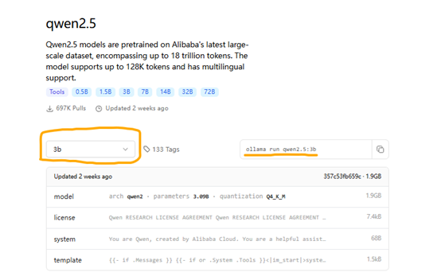

这里我们以3B大小的Qwen2.5模型为例，它对应的指令为「ollama run qwen2.5:3b」。我们按照之前的方法打开「命令提示符」窗口，输入刚才得到的指令并按下回车键，将会自动开始下载模型文件，并将在下载好后自动运行模型。

看到「success」和「Send a message」字样则说明模型下载并运行成功，此时输入信息并按下回车就可以和模型进行对话了。

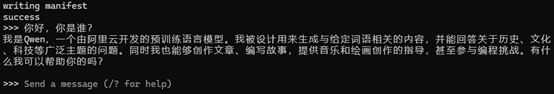

成功得到模型回复，说明模型已顺利运行。

### 4.在Docker容器中部署作为RAG知识库问答系统的MaxKB

首先，我们参照教程「[https://docker-practice.github.io/zh-cn/install/windows.html](https://docker-practice.github.io/zh-cn/install/windows.html)」完成Docker的安装。注意，这里并不推荐设置国内镜像加速。

安装好Docker后，按照之前的方法打开「命令提示符」窗口，输入命令「docker run -d --name=maxkb --restart=always -p 8080:8080 -v D:/MaxKB:/var/lib/postgresql/data -v D:/MaxKB/python-packages:/opt/maxkb/app/sandbox/python-packages cr2.fit2cloud.com/1panel/maxkb」将自动部署MaxKB至Docker容器中。

上述命令中「8080:8080」表明容器与物理机的端口映射，「D:/ MaxKB」与「D:/ MaxKB/python-packages」分别对应MaxKB的数据存储地址以及python包的存储地址，可以根据实际情况自行修改。出现如下字样则表明容器部署完成。

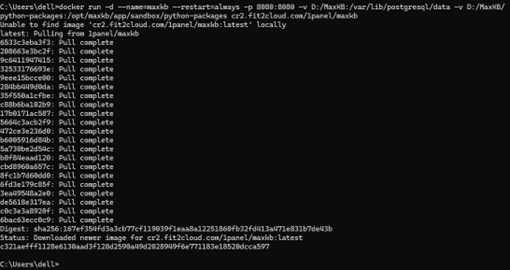

此时，在浏览器中访问「http://localhost:8080/」即可进入MaxKB的系统后台，初始管理员账户的用户名与密码分别为「admin」与「MaxKB@123..」。

依次选择「系统管理」、「模型设置」进入模型设置界面，点击「添加模型」按钮将我们刚才通过Ollama部署的本地大预言模型添加进后台当中。

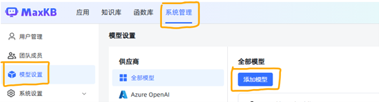

在选择供应商界面，我们选择「Ollama」。

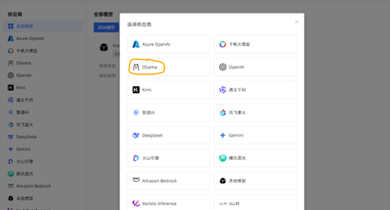

模型名称与权限根据需要自行设置，模型类型选择「大语言模型」。

基础模型项则需输入部署模型命令中的模型名称，以我们本次部署的模型为例，部署模型使用的命令是「ollama run qwen2.5:3b」，所以我们在这里填写「qwen2.5:3b」。

由于MaxKB被我们部署在Docker容器中，无法直接访问物理机的资源，所以API域名项中我们需要填写「http://host.docker.internal:11435」，其中「11435」则为我们之前自行设置的Ollama端口。

API Key项随意填写一些内容即可。

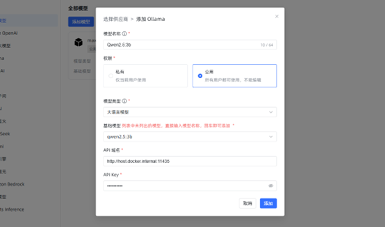

如果我们自行添加的模型没有报错，成功出现在全部模型中，则说明所有的信息与配置填写正确。如果提示无法访问API等错误信息，请检查Ollama是否部署正确、服务是否能够正常访问，并检查信息是否填写正确。

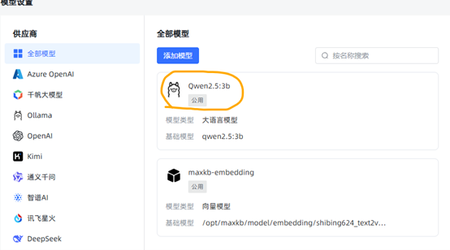

完成模型添加后我们返回「应用」面板并点击「创建应用」按钮，创建我们的大语言模型应用。这里的「应用名称」、「应用描述」、「应用类型」则根据需要自行设置。

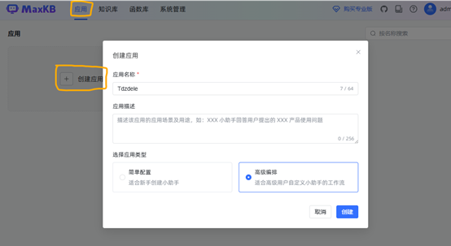

创建完应用后，在设置中为我们的应用对话选择刚才添加好的模型。点击右上角「发布」按钮完成应用发布后返回。

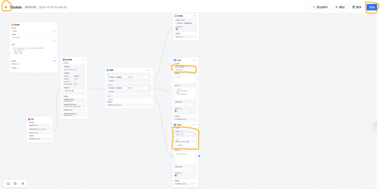

使用浏览器访问「公开访问链接」或点击「演示」按钮，即可进入部署好的大预言模型对话界面。

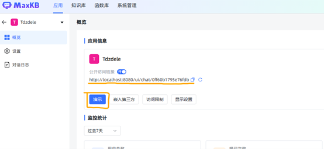

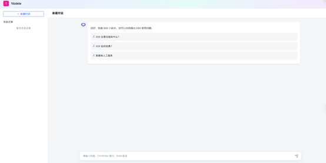

模型的对话预设与提示词等内容，则可以在应用设置中进行进一步的修改。

至此，我们完成了大语言模型的本地部署以及RAG知识库问答系统的搭建。