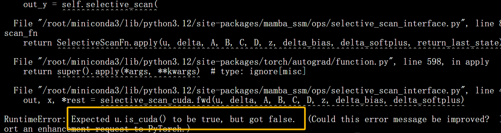

最近在做YOLO相关的工作，在尝试运行Mamba结构相关的模块时，遇到了一个很奇怪的问题。明明设备的显卡与CUDA部署没有问题，其他的代码也能正常运行，但是只要在模型结构中加入Mamba相关的模块，就会提示Expected u.is_cuda() to be true, but got false.，提示CUDA有问题。



在网络上搜索了很久也没有找到合适的解决方案，大家都是排查CUDA的问题或者尝试绕过selective——scan——cuda.fwd()这个函数。

苦苦排查了很久，终于让我找到了解决办法。在"ultralytics-main/ultralytics/nn/tasks.py"中，找到"class DetectionModel(BaseModel):"下的"m.stride = torch.tensor([s / x.shape[-2] for x in _forward(torch.zeros(1, ch, s, s))])  # forward"这行代码，将其修改为如下代码，即可完美解决该问题。

```
            try:
                m.stride = torch.tensor([s / x.shape[-2] for x in _forward(torch.zeros(1, ch, s, s))])  # forward on CPU
            except RuntimeError:
                try:
                    self.model.to(torch.device('cuda'))
                    m.stride = torch.tensor([s / x.shape[-2] for x in _forward(
                        torch.zeros(1, ch, s, s).to(torch.device('cuda')))])  # forward on CUDA
                except RuntimeError as error:
                    raise error
```


