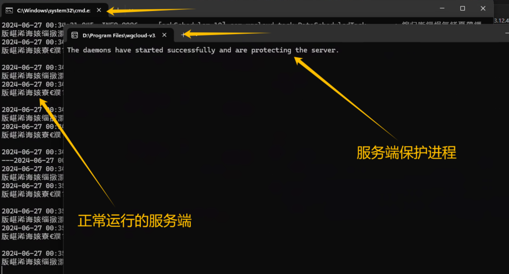
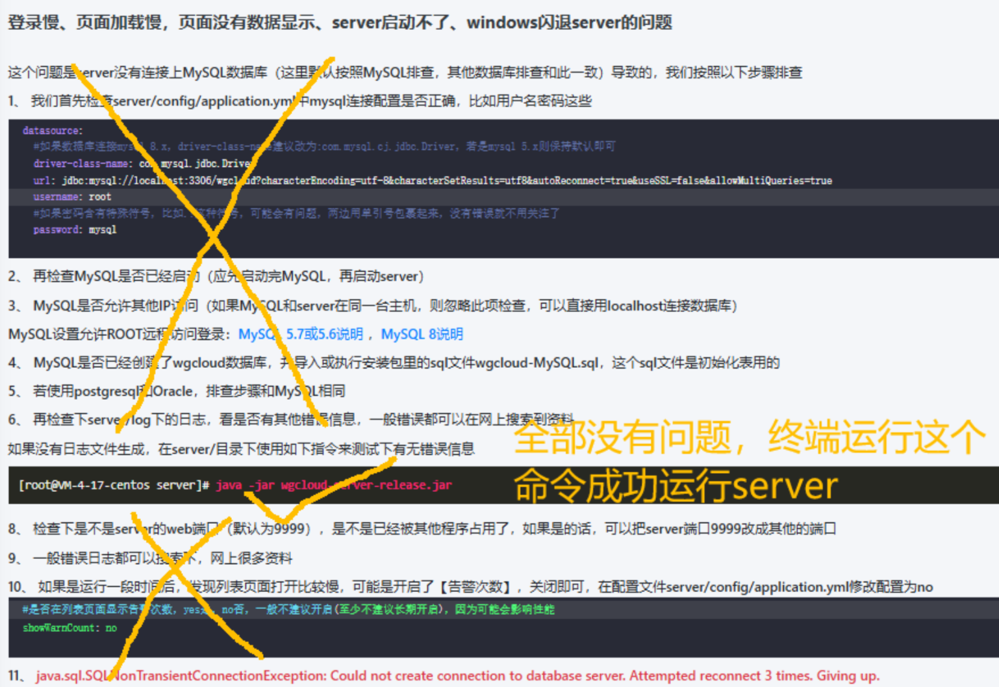
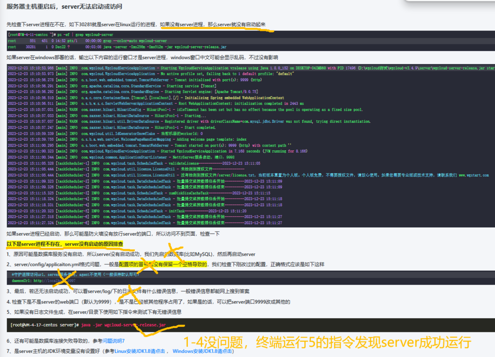

学院新购入了服务站，想部署WGCLOUD用来远程监控资源使用情况，在部署的时候按照官方教程全流程走下来，全部运行好之后"http://localhost:9999/"被拒绝访问，无法打开WGCLOUD的Web后台。

经过仔细排查后发现，是在运行server服务端的start.bat时，正常应该有两个终端窗口在运行（一个是服务端本体，一个是服务端保护进程），而服务端本体的终端窗口在运行后直接闪退了，只留下了服务端保护进程的终端窗口。

最开始没仔细看，看到有一个终端窗口留着而且显示着“started successfully”字样直接以为运行成功了，排查了好多之后才发现。。。



跟着官网上的两篇排查文档（第一篇是[登录慢、页面加载慢，页面没有数据显示、server启动不了、windows闪退server的问题](https://www.wgstart.com/issues/docs7.html)，第二篇是[服务器主机重启后，server无法启动或访问](https://www.wgstart.com/issues/docs69.html)）走过一遍，也没有发现问题。





最后，经过一通胡乱操作，修改了一下start.bat的代码，server成功运行了。

start.bat原本的代码如下：

```
echo %cd%
start /d "%cd%" wgcloud-daemon-release.exe
java  -Xms256m -Xmx512m  -jar %cd%/wgcloud-server-release.jar
```

修改后的start.bat的代码如下：

```
start wgcloud-daemon-release.exe
java -jar wgcloud-server-release.jar
```

修改后的代码就可以正常运行了，暂时没发现有什么问题，问题成功解决。如果有遇到同样的问题，所有的环节都没出错，直接运行server可以运行，但是通过start.bat运行server进程就是会直接闪退，可以尝试一下这个解决方法。

具体的原因我也不是特别清楚，如果有懂得朋友可以在评论里说一下。不过可以确定的是，不是爆Java虚拟机内存的问题，源代码如果仅删除“-Xms256m -Xmx512m”这一部分的话仍然会在运行后直接闪退。